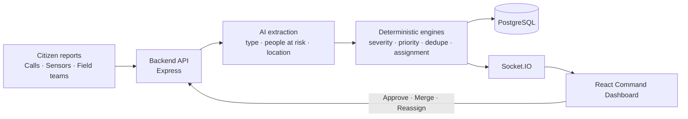

# 🚨 AI Incident Commander — SURGE

**Intelligent Emergency Response & Resource Coordination Platform**


> SURGE takes dozens of chaotic reports from many channels and collapses them into a few clear incidents. It tells the commander exactly which resource to send and why, and it re-plans instantly when a resource fails.

---

## 📌 Table of Contents

1. [The Problem](#-the-problem)
2. [Our Solution](#-our-solution)
3. [Key Features](#-key-features)
4. [How It Works](#-how-it-works)
5. [AI vs Deterministic Logic](#-ai-vs-deterministic-logic)
6. [Tech Stack](#-tech-stack)
7. [Project Structure](#-project-structure)
8. [Getting Started](#-getting-started)
9. [API Contract](#-api-contract)
10. [Real-Time Events](#-real-time-events)
11. [Demo Walkthrough](#-demo-walkthrough)
12. [Design Principles](#-design-principles)
13. [Roadmap](#-roadmap)
14. [Team](#-team)

---

## 🔥 The Problem

During large-scale emergencies such as floods, fires, industrial accidents, and major road incidents, information arrives from many disconnected sources:

- Emergency calls
- Citizen reports
- Sensors
- Field teams
- Hospitals
- Government departments

A control-room dispatcher has to make sense of all of it at once. In practice this causes:

| Pain point | Consequence |
|---|---|
| **Fragmented information** | The same incident is reported 10+ times in different words and languages, so nobody sees the real picture. |
| **Manual triage** | Severity and priority are judged by gut feel, so critical cases can wait behind minor ones. |
| **Unclear resource decisions** | Units are dispatched by phone and memory, with no view of ETA, capability, or workload. |
| **No plan B** | When a dispatched unit breaks down or is delayed, it is often noticed late and re-planned manually. |
| **Shortages discovered too late** | Teams learn they are out of boats or ambulances only after an incident has escalated. |

Every minute of delay in first response matters, and this is a coordination problem before it is a resource problem.

---

## 💡 Our Solution

SURGE is an **AI-assisted command-center platform** that gives an emergency commander one live screen to:

1. **See** what is happening across all channels.
2. **Understand** how serious it is and *why*.
3. **Decide** what to send, using explainable recommendations.
4. **Act** with a human-approved dispatch.
5. **Recover** automatically when the plan is compromised.

A human commander always makes the final call. The AI reads, ranks, explains, and drafts, and the commander approves.

---

## ✨ Key Features

### 📥 Incident Collection
Reports arrive from citizens, emergency calls, sensors, and field teams into a single incident pipeline.

### 🧠 AI Classification & Severity
Each incident gets a **type**, **severity score**, **priority (P1–P4)**, **confidence**, and **people-at-risk** estimate. Severity comes with a structured, explainable factor breakdown.

### 🔍 Duplicate Detection & Merge
Related reports are detected and shown with a relatedness score and reasons (same type, distance, timing, similar wording). The commander can **Merge** or **Keep Separate**.

### 📂 Evidence Panel
Every incident shows the evidence behind it: citizen reports, calls, sensor readings, and field updates, and how each contributes.

### 🚑 Resource Recommendation
The system recommends resources with capability, distance, ETA, availability, workload, a score, and reasons. Dispatch happens only on the commander's **APPROVE**.

### ⚠️ Dynamic Response Recovery
If a dispatched resource fails, the UI shows **RESPONSE PLAN COMPROMISED** with the failed unit, the original ETA, a recommended alternative, and the delay impact. One click approves the reassignment.

### 🗺️ Live Emergency Map
Incidents, ambulances, fire teams, police, rescue teams, hospitals, and shelters are shown on a Leaflet map with distinct markers.

### 🔔 Alerts & Notifications
Real-time alerts for critical incidents, severity escalation, resource failure, response delays, resource shortages, and unresolved high-priority incidents.

### 🕒 Live Timeline
Every action is logged in real time, from report received to reassignment approved.

### 📊 Analytics
Incident types, severity distribution, incidents over time, response times and delays, resource utilization, shortages, and frequently affected areas.

### 🤖 AI Operational Briefing
One click generates an AI-written summary of the current operational situation.

### 🎮 Demo Controls
Buttons to generate a flood, fire, accident, duplicate reports, resource failure, and delays, so the full workflow can be shown live.

---

## ⚙️ How It Works



**Frontend responsibility:** display backend results and let the commander perform actions through APIs. Business logic stays in the backend.

**Backend responsibility:** AI processing, severity and priority calculation, duplicate detection, merging, resource recommendation, ETA, assignment, failure and recovery logic, alerts, notifications, and analytics.

---

## 🧭 AI vs Deterministic Logic

Emergency decisions must be auditable, so we separate what the AI *reads* from what the rules *decide*.

| AI / LLM | Deterministic logic |
|---|---|
| Turns free-text reports into structured fields | Final severity score and P1–P4 priority |
| Handles multilingual input | Duplicate clustering (distance, time, type) |
| Helps with ambiguous related-incident calls | Resource matching, ETA, capacity |
| Writes summaries and operational briefings | Failure detection, recovery options, alerts |

Severity is explained through structured factors provided by the backend, for example:

```text
Severity Score: 91
+ High people at risk
+ Multiple corroborating reports
+ Sensor confirmation
+ High spread potential
+ Infrastructure impact
```

---

## 🛠️ Tech Stack

| Layer | Technology |
|---|---|
| **Frontend** | React, Vite, JavaScript/JSX, Tailwind CSS, React Router |
| **Maps** | Leaflet, React-Leaflet |
| **Charts** | Recharts |
| **Icons** | Lucide React |
| **Data fetching** | Axios / fetch |
| **Real-time** | Socket.IO |
| **Backend** | Node.js, Express |
| **Database** | PostgreSQL |
| **AI** | LLM API for extraction and summaries |

---

## 📁 Project Structure

```text
.
├── frontend/
│   ├── src/
│   │   ├── components/      # Header, IncidentList, EmergencyMap, AICommandPanel,
│   │   │                    # RecommendationCard, RecoveryPanel, Timeline, ...
│   │   ├── pages/           # Dashboard, IncidentDetails, Analytics
│   │   ├── layouts/         # CommandLayout
│   │   ├── services/        # api/ (REST) and socket.js
│   │   ├── hooks/           # useSocket, useIncidents, useResources
│   │   ├── mock/            # mockData.js (matches the API contract)
│   │   └── types/           # API shape reference
│   ├── .env.example
│   └── package.json
│
└── backend/                 # Express API, AI processing, engines, PostgreSQL
```

---

## 🚀 Getting Started

### Prerequisites

- Node.js 18+
- npm
- PostgreSQL (only when running the real backend)

### Frontend

```bash
cd frontend
npm install
cp .env.example .env
npm run dev
```

The frontend can run in two modes, controlled from `.env`:

| Mode | Setting | Use |
|---|---|---|
| **Mock mode** | `VITE_USE_MOCK=true` | Full demo with no backend, using mock data and a mock event emitter |
| **Live mode** | `VITE_USE_MOCK=false` | Talks to the real backend API and Socket.IO server |

See `.env.example` for the exact variable names, including the backend URL.

### Backend

```bash
cd backend
npm install
# configure database and LLM API key in .env
npm run dev
```

---

## 🔌 API Contract

| Method | Endpoint | Purpose |
|---|---|---|
| GET | `/api/incidents` | List incidents |
| GET | `/api/incidents/:id` | Incident details |
| POST | `/api/incidents` | Create incident |
| PATCH | `/api/incidents/:id` | Update incident |
| POST | `/api/reports` | Submit a report |
| POST | `/api/incidents/:id/analyze` | Run AI analysis |
| POST | `/api/incidents/:id/merge` | Merge related incidents |
| POST | `/api/incidents/:id/briefing` | Generate AI briefing |
| GET | `/api/resources` | List resources |
| PATCH | `/api/resources/:id/status` | Update resource status |
| GET | `/api/incidents/:id/recommendations` | Resource recommendations |
| POST | `/api/assignments` | Create assignment |
| POST | `/api/assignments/:id/approve` | Approve dispatch |
| POST | `/api/incidents/:id/simulate-resource-failure` | Demo: fail a resource |
| POST | `/api/incidents/:id/recover` | Approve recovery plan |
| GET | `/api/alerts` | List alerts |
| PATCH | `/api/alerts/:id/acknowledge` | Acknowledge alert |
| GET | `/api/analytics` | Analytics data |

---

## ⚡ Real-Time Events

| Event | Effect in the UI |
|---|---|
| `incident:created` | New incident appears in the list and on the map |
| `incident:updated` | Incident data refreshes |
| `incident:merged` | Merged incident replaces its sources |
| `incident:severity_changed` | Severity badge updates and escalation is highlighted |
| `resource:updated` | Resource status changes on the map and in lists |
| `resource:assigned` | Assigned unit appears heading to the incident |
| `resource:failed` | **Response plan compromised** panel appears |
| `resource:reassigned` | Map, incident response, and timeline update |
| `alert:created` | Alert center updates |
| `notification:created` | Toast notification appears |
| `activity:new` | New entry is added to the live timeline |

---

## 🎬 Demo Walkthrough

1. Flood reports arrive.
2. An incident appears and becomes **CRITICAL**.
3. Related reports are detected.
4. The commander reviews evidence and **merges** the duplicates.
5. The AI recommends the best resource, with reasons.
6. The commander clicks **APPROVE DISPATCH**.
7. The resource appears on the map and starts moving.
8. A resource failure is simulated.
9. **RESPONSE PLAN COMPROMISED** appears with an alternative and the delay impact.
10. The commander approves the reassignment.
11. The map, timeline, and notifications update.
12. The AI generates an operational briefing.

---

## 🎨 Design Principles

- **Command-center clarity:** the most important information (`CRITICAL`, `P1`, `RESOURCE FAILURE`, `RESPONSE PLAN COMPROMISED`) is always the most visible.
- **Colour has one meaning each:** severity colours are reserved for severity, and one accent is reserved for AI-generated content.
- **Never colour alone:** every status pairs colour with a text label and an icon.
- **Information-dense but calm:** compact cards, clear hierarchy, subtle motion only where it helps.
- **Explainable by default:** every recommendation shows its reasons.

---

## 🗺️ Roadmap

- [x] Project scaffolding, design tokens, and layout shell
- [ ] Mock data layer and state contexts
- [ ] Incident list, details, and live map
- [ ] AI command panel, explainability, and evidence
- [ ] Duplicate detection and merge flow
- [ ] Recommendation and dispatch approval
- [ ] Dynamic response recovery
- [ ] Socket.IO integration, alerts, and timeline
- [ ] Analytics dashboard
- [ ] Demo controls and final polish

**Future ideas**

- SMS, email, and messaging-app notifications to field teams
- Real road-network routing and real hospital capacity data
- Voice-call transcription pipeline
- Multilingual citizen intake channels
- Predictive resource pre-positioning from historical incidents

---

## 👥 Team

| Role | Name |
|---|---|
| Frontend | Trushi ([@trushi-jasani](https://github.com/trushi-jasani)) |
| Backend & AI | ([@parita-31]([ht](https://github.com/parita-31))|

Built for a 24-hour hackathon: **PS-9 — Intelligent Emergency Response & Resource Coordination Platform**.

---

## 📄 License

Add your preferred license here (for example, MIT).
